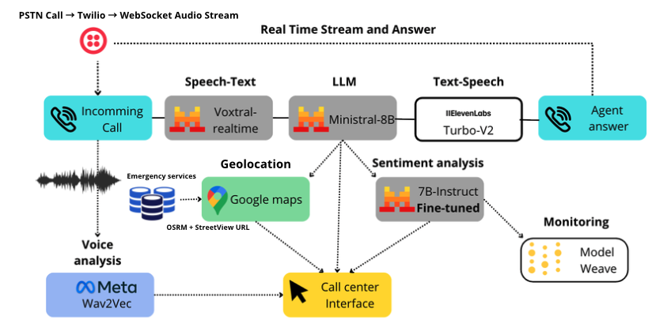

# AuxilAI

**AuxilAI** is an AI-powered 911 emergency dispatch system designed to handle massive incoming call volumes during catastrophic events — fires, accidents, medical emergencies, criminal incidents — when human call centers are overwhelmed.

The system acts as an intelligent first responder: it answers emergency calls in real time (via phone or browser), gathers critical information through natural conversation, geolocates the incident, identifies the nearest emergency service, calculates the optimal route, and dispatches the right responders — all automatically, in seconds.

> **AuxilAI does not replace human dispatchers.** It is built to handle localized, high-volume call surges so that human operators can focus on the most complex situations.

---

[](https://youtu.be/5ub9Y-JuZKU)

---

## 🏗️ Technical Architecture



### Call flows

**Real phone call (Twilio)**
```
Caller → PSTN → Twilio → POST /twilio/incoming
  → TwiML <Stream url="wss://backend/twilio/stream">
  → WS /twilio/stream (mulaw 8kHz, 20ms chunks)
  → VAD (RMS > 400) → PCM buffer
  → 500ms silence → STT: Mistral voxtral-mini-2507
  → text → Agent: ministral-8b streaming
  → complete sentence → TTS: ElevenLabs eleven_turbo_v2_5 (PCM 8kHz)
  → mulaw → Twilio → Caller
  → extract_call_info() → geocode() → find_nearest() → get_route()
  → broadcast() → Dashboard
  → call end → SMS summary → operator
```

**Dashboard (real-time)**
```
Dashboard WS /dashboard
  ← broadcast({event: "db_response", data: all_calls})
  → click dispatch → ws.send({type:"dispatch", call_id, service})
  → backend _handle_dispatch() → update_call() → broadcast()
```

### External services

| Service | Usage | Module |
|---|---|---|
| **Mistral `ministral-8b-latest`** | Dispatcher AI chat (streaming) | `agent.py` |
| **Mistral `voxtral-mini-2507`** | Speech-to-text transcription | `stt.py` |
| **ElevenLabs `eleven_turbo_v2_5`** | Text-to-speech (Sarah voice) | `tts.py` |
| **Twilio** | Telephony + SMS | `twilio_voice.py`, `sms.py` |
| **Google Maps** | Geocoding + Street View | `geocoding.py` |
| **OSM Overpass API** | Fire stations + hospitals lookup | `emergency_services.py` |
| **OSRM / Valhalla** | Real route calculation | `emergency_services.py` |
| **SpeechBrain wav2vec2** | Vocal emotion analysis | `voice_emotion.py` |

---

## 🗂️ Repository Structure

```
mistral-hack/
├── backend/                      # Core Python service modules
│   ├── main.py                   # FastAPI entry point, lifespan startup
│   ├── agent.py                  # AI Agent (Mistral), WebSocket /voxtral
│   ├── twilio_voice.py           # Twilio telephony integration
│   ├── socket_manager.py         # WebSocket broadcast manager
│   ├── db.py                     # In-memory calls database
│   ├── prompts.py                # System + extraction prompts
│   ├── stt.py                    # Speech-to-text (Mistral Voxtral)
│   ├── tts.py                    # Text-to-speech (ElevenLabs)
│   ├── sms.py                    # Post-call SMS summary (Twilio)
│   ├── geocoding.py              # Google Maps geocoding + Street View
│   ├── emergency_services.py     # Nearest service + routing (OSRM/Valhalla)
│   ├── voice_emotion.py          # Vocal emotion analysis (SpeechBrain)
│   └── test.py                   # Manual tests
├── data/
│   └── police.json               # Paris police stations dataset
├── dataset/                      # Fine-tuning dataset (2000 samples)
├── data_gen/                     # Dataset generation scripts
├── fine_tuning/                  # HuggingFace fine-tuning + W&B
├── test_depoly/                  # SageMaker deployment test
├── frontend/                     # Dispatcher dashboard (HTML/CSS/JS)
│   ├── index.html
│   ├── app.js
│   └── style.css
├── demo/
│   └── demo_mistral_hack.mp4     # Demo video
├── pyproject.toml
└── requirements.txt
```

---

## 🚀 Getting Started

1. **Create & activate a virtual environment**
   ```bash
   python -m venv venv
   source venv/bin/activate   # macOS/Linux
   venv\Scripts\activate      # Windows
   ```

2. **Install dependencies**
   ```bash
   pip install -r requirements.txt
   ```

3. **Configure environment variables**

   Create a `.env` file in `backend/`:
   ```env
   MISTRAL_API_KEY=...
   ELEVENLABS_API_KEY=...
   ELEVENLABS_VOICE_ID=...       # defaults to Sarah
   TWILIO_ACCOUNT_SID=...
   TWILIO_AUTH_TOKEN=...
   TWILIO_PHONE_NUMBER=...
   OPERATOR_PHONE=...            # SMS recipient after call ends
   PUBLIC_URL=...                # public hostname for Twilio webhook
   ```

4. **Run the service**
   ```bash
   cd backend
   uvicorn main:app --host 0.0.0.0 --port 8000
   ```
   The dashboard is served at `http://localhost:8000/static/index.html`.

5. **Expose to Twilio** (for real calls)

   Use [ngrok](https://ngrok.com) or any tunnel to expose port 8000, then set the Twilio webhook to:
   ```
   POST https://<your-public-url>/twilio/incoming
   ```

---

## 🛠️ Key Features

- **AI Dispatcher** — Mistral `ministral-8b` handles the conversation, asks the right questions, stays calm and professional
- **Real phone support** — Full Twilio Media Streams integration with barge-in (caller can interrupt the agent mid-sentence)
- **Voice Activity Detection** — RMS-based VAD, no external library needed
- **Streaming STT** — Mistral `voxtral-mini-2507` for fast, accurate transcription
- **Streaming TTS pipeline** — ElevenLabs generates audio sentence-by-sentence in parallel with the LLM stream
- **Automatic info extraction** — Structured JSON extracted after each exchange (type, severity, location, emotions, scores)
- **Geocoding + Street View** — Google Maps resolves the address and returns a street-level image for the dispatcher
- **Nearest service routing** — Haversine + OSRM/Valhalla to find and route the closest police, fire, or medical unit
- **Real-time dashboard** — WebSocket broadcast keeps all connected dashboards in sync instantly
- **Post-call SMS** — Twilio SMS sends a summary + safety instructions to the operator after each call
- **Vocal emotion analysis** — SpeechBrain wav2vec2-IEMOCAP classifies caller's emotional state in real time

---

## 📦 Dependencies

See `requirements.txt`. Core libraries: `fastapi`, `uvicorn`, `mistralai`, `twilio`, `elevenlabs`, `speechbrain`, `googlemaps`, `requests`, `python-dotenv`.

---

## 🧪 Testing

`backend/test.py` contains manual test snippets. For a full end-to-end test, use the browser interface at `/static/index.html` with the Voxtral WebSocket mode (no phone required).

---

## 🤝 Contributing

Contributions are welcome. Fork the repository, make your changes, and open a pull request. Please document any new endpoints or features.
